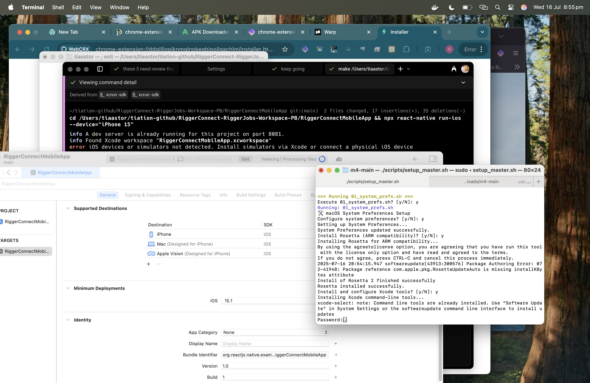

<button class="theme-toggle" onclick="toggleTheme()">
  <span id="theme-icon">🌙</span> <span id="theme-text">Dark</span>
</button>

<div class="particles" id="particles"></div>

<nav class="fun-menu">
  <div class="menu-container">
    <a href="#features" class="menu-item active">🚀 Features</a>
    <a href="#architecture" class="menu-item">🏗️ Architecture</a>
    <a href="#quick-start" class="menu-item">⚡ Quick Start</a>
    <a href="#api" class="menu-item">📚 API</a>
    <a href="#deployment" class="menu-item">🚀 Deploy</a>
  </div>
</nav>

<div class="hero-section">
  <div class="hero-content">
    <h1 class="glitch" data-text="Tiation CMS">💎 Tiation CMS</h1>
    <p class="hero-subtitle">⚡ Enterprise-grade headless CMS for industry-specific content management</p>
    <div class="hero-buttons">
      <a href="#features" class="btn btn-primary pulse">🔥 Explore Features</a>
      <a href="#quick-start" class="btn btn-secondary">⚡ Quick Start</a>
    </div>
  </div>
  <div class="hero-animation">
    <div class="floating-icons">
      <div class="icon">💎</div>
      <div class="icon">⚡</div>
      <div class="icon">🚀</div>
      <div class="icon">✨</div>
    </div>
  </div>
</div>

<div class="screenshot-section">
  <h2>Live Preview</h2>
  <div class="screenshot-container">
    
    <div class="screenshot-overlay">
      <div class="screenshot-text">
        <h3>🌈 Enterprise-Grade CMS</h3>
        <p>See the powerful headless CMS in action with advanced content management capabilities!</p>
      </div>
    </div>
  </div>
</div>

## Features

- **Headless Architecture**: Decouple content management from presentation
- **Industry-Specific**: Tailored for specific vertical requirements
- **Enterprise-Grade**: Built for scale with security and performance in mind
- **API-First**: RESTful API for seamless integration
- **User-Friendly**: Intuitive admin interface for content management
- **Extensible**: Modular architecture for custom functionality

## Architecture

```
┌─────────────────┐    ┌─────────────────┐    ┌─────────────────┐
│   Admin Panel   │    │   Content API   │    │   Frontend App  │
│   (React/Vue)   │◄──►│   (Node.js)     │◄──►│   (Any Tech)    │
└─────────────────┘    └─────────────────┘    └─────────────────┘
                             │
                             ▼
                    ┌─────────────────┐
                    │    Database     │
                    │  (PostgreSQL)   │
                    └─────────────────┘
```

## Quick Start

1. **Clone the repository**
   ```bash
   git clone https://github.com/yourusername/tiation-cms.git
   cd tiation-cms
   ```

2. **Install dependencies**
   ```bash
   npm install
   ```

3. **Set up environment variables**
   ```bash
   cp .env.example .env
   # Edit .env with your configuration
   ```

4. **Initialize database**
   ```bash
   npm run db:init
   ```

5. **Start development server**
   ```bash
   npm run dev
   ```
